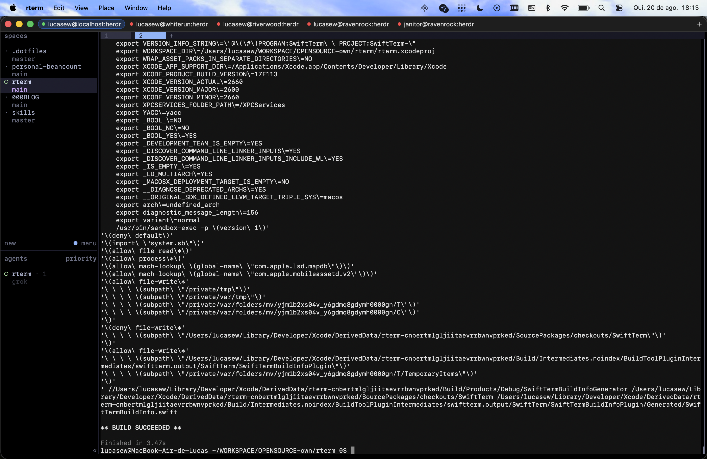
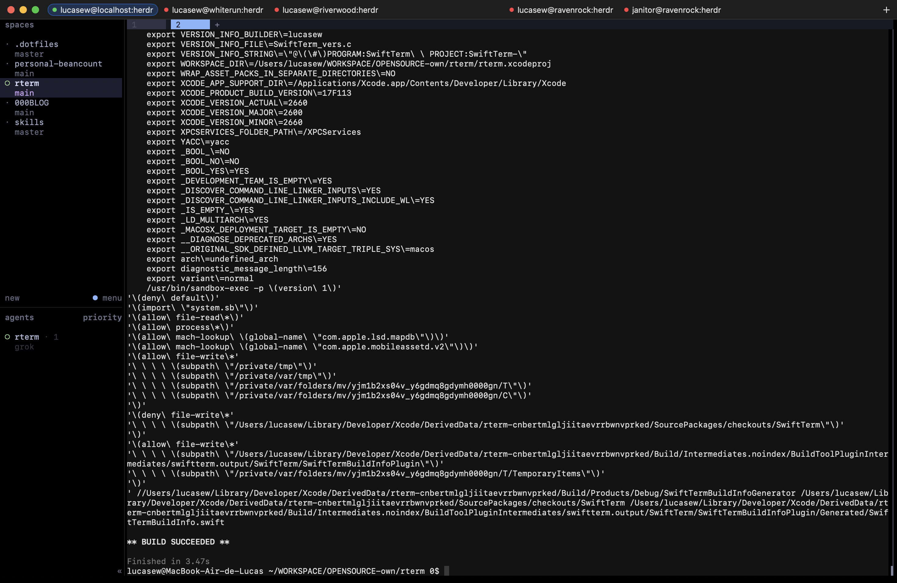

# rterm

A Mac app that supervises detachable terminal sessions. It is not a general local-shell terminal.

Each tab is a **place**: a saved attach target. Click a tab to attach. Sleep drops the local process. The remote herdr, tmux, or screen session keeps running. Wake does not reconnect. Click the tab or choose Reconnect.





## Places

A place is user, host, and backend (`herdr`, `tmux`, or `screen`). tmux and screen also need a session name.

- Empty host, `localhost`, or `127.0.0.1` is this Mac. No SSH. Label: `you@localhost:herdr`.
- A real host uses `/usr/bin/ssh`. Label: `user@host:herdr` or `user@host:tmux(foo)`.

herdr attach uses the binary that owns `herdr.sock` on that machine. PATH `herdr` can be a different version.

The catalog is `~/Library/Application Support/rterm/places.toml`. The app writes it. Edits on disk reload. Use **+** or **Place → Add Place…**.

Tab dots: grey idle, green alive, red failed. SSH keepalives make a dead path exit.

## Keyboard

| Shortcut | Action |
| --- | --- |
| ⌘1 … ⌘9 | Select place 1–9 |
| ⌘0 | Select place 10 |
| ⌘N | Add place |
| ⌘R | Reconnect the selected place |

One window only. Splits belong to herdr or tmux on the destination.

## Build

You need Xcode and [mise](https://mise.jdx.dev/).

```bash
git clone https://github.com/lewtec/rterm.git
cd rterm
mise install
mise run build
open "$(echo ~/Library/Developer/Xcode/DerivedData/rterm-*/Build/Products/Debug/rterm.app)"
```

`mise run generate` writes `rterm.xcodeproj`. `mise run test` runs the unit tests.

## Release

The public version is the git tag. `svu` picks the next tag. The Release build stamps that tag into `MARKETING_VERSION`. Do not commit a version bump.

Same operator API as the other lewtec repos:

1. GitHub → Actions → Autorelease → Run workflow
2. Pick `next`, `patch`, `minor`, or `major`
3. That runs `mise release $NEW_VERSION`: tag with `svu`, build a universal DMG, publish with GoReleaser

First release: pick **minor** (`0.1.0`). There are no tags yet, so `patch` would mint `0.0.1`.

Locally: `mise release minor`. A DMG without a GitHub release: `VERSION=0.1.0-dev mise package`.

The DMG is unsigned. First open: right-click rterm → Open.

Design rules live in [SPEC.md](SPEC.md).
